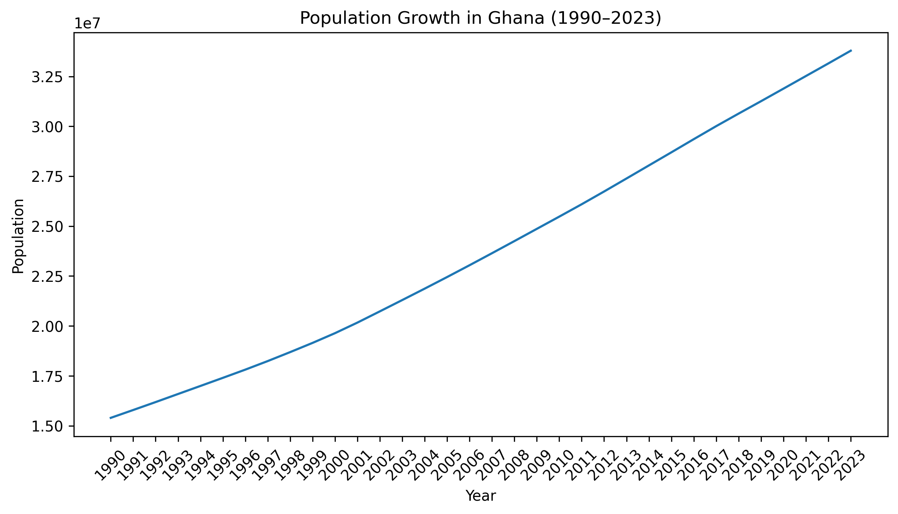
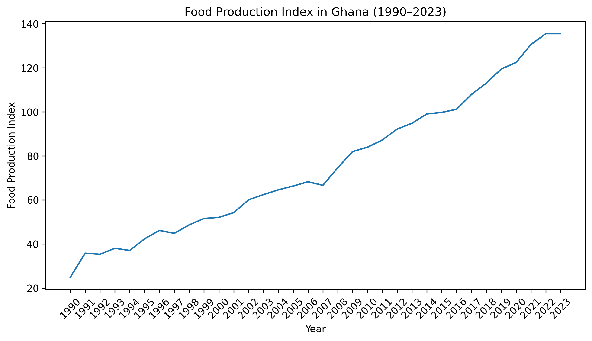
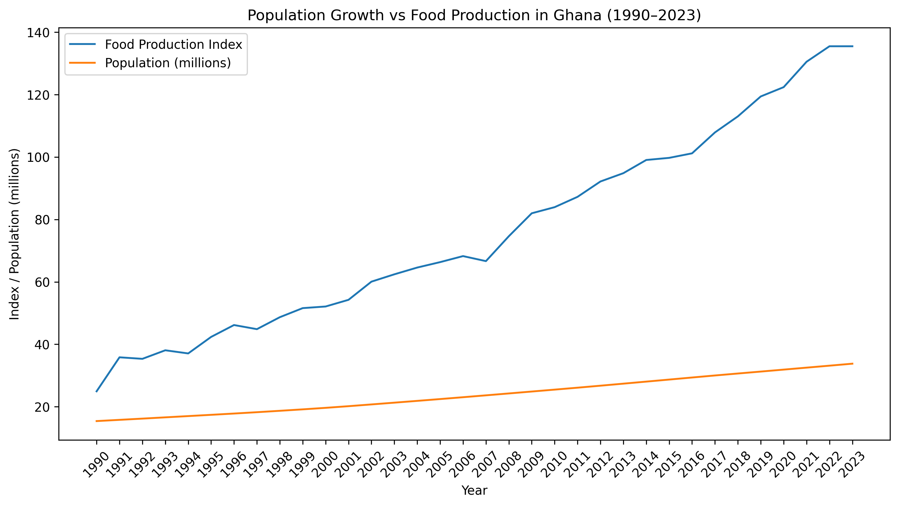
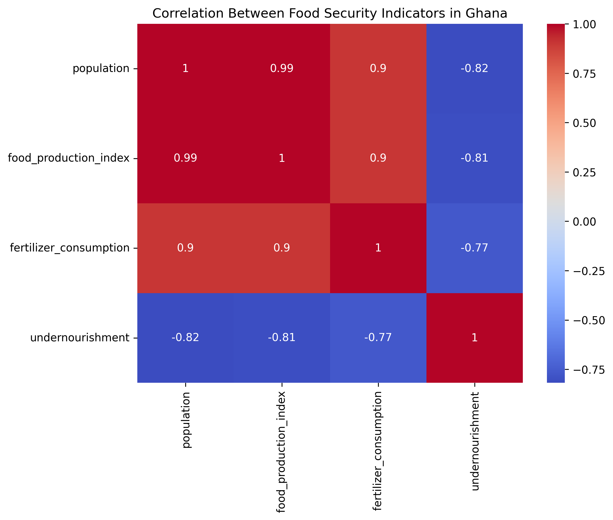
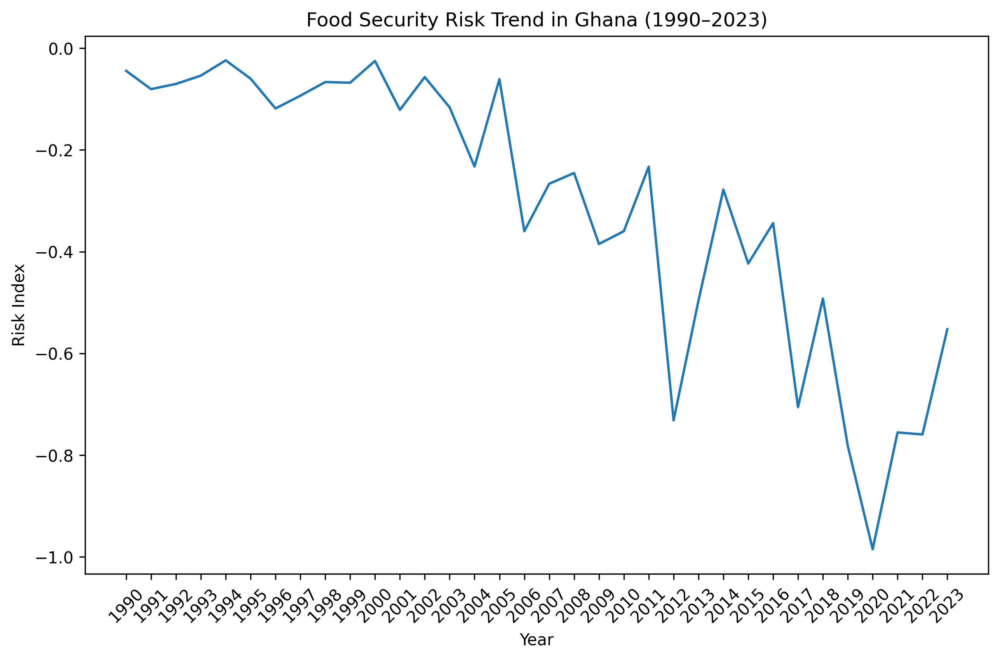

 **Food Security Trends in Ghana (1990–2023).**
 
 A Python-based analysis of food security trends in Ghana using World Bank data (1990–2023).


 **Project Highlights**

- Analysis of 30+ years of food security data in Ghana

- Data retrieved directly from the World Bank API

- Exploratory data analysis of population, food production, fertilizer consumption, and undernourishment

- Correlation analysis to understand relationships between key food security indicators

- Development of a Food Security Risk Index using normalized variables

- Clear visualizations to communicate long-term agricultural and demographic trends


  ## Project Workflow
```
The project follows a structured data analysis pipeline:

World Bank API
      ↓
Data Extraction (wbdata)
      ↓
Data Cleaning (Pandas)
      ↓
Handling Missing Values
      ↓
Exploratory Data Analysis
      ↓
Correlation Analysis
      ↓
Feature Engineering
(Food Security Risk Index)
      ↓
Data Visualization
      ↓
Insights & Interpretation
```

**Methodology**

```
The analysis follows a structured data analysis workflow:

Data Collection
        ↓
Data Cleaning & Preparation
        ↓
Exploratory Data Analysis
        ↓
Correlation Analysis
        ↓
Feature Engineering
(Food Security Risk Index)
        ↓
Visualization & Interpretation
```

**Skills Demonstrated**

This project demonstrates the following data analysis skills:

Data Collection

- Accessing public datasets through APIs


Data Cleaning

- Handling missing values

- Interpolating time-series data

- Data transformation


Exploratory Data Analysis

- Trend analysis

- Comparative visualization


Statistical Analysis

- Correlation analysis

- Feature engineering


Data Visualization

- Line plots

- Comparative trend charts

- Heatmaps


Programming

- Python

- Pandas

- Matplotlib

- Seaborn

- Scikit-learn


 
 **Project Overview**

This project analyzes long-term food security trends in Ghana between 1990 and 2023 using data from the World Bank’s World Development Indicators.

Food security is influenced by multiple factors including population growth, agricultural productivity, and access to farming inputs such as fertilizer.
This analysis explores how these variables interact over time and whether agricultural production has kept pace with Ghana’s growing population.

The project demonstrates a complete data analysis workflow in Python, including data extraction from an API, data cleaning, exploratory data analysis, 
statistical correlation analysis, and the creation of a custom food security risk indicator.

**Research Questions**

This project aims to answer the following questions:

- How has Ghana’s population changed between 1990 and 2023?
- Has food production increased at a rate that can support population growth?
- What is the relationship between fertilizer use and agricultural productivity?
- How is undernourishment related to food production and other indicators?
- Can a simple composite index be created to estimate food security risk over time?

**Data Source**

Data was retrieved directly from the World Bank World Development Indicators (WDI) using the `wbdata` Python library.

Indicators used:

| Indicator                      | Description                                                   |
| ------------------------------ | ------------------------------------------------------------- |
| Population                     | Total population of Ghana                                     |
| Food Production Index          | Agricultural production relative to base period               |
| Fertilizer Consumption         | Fertilizer use in agricultural production                     |
| Prevalence of Undernourishment | Percentage of the population with insufficient caloric intake |

Time range: 1990–2023

**Tools and Technologies**

The analysis was conducted using the following tools:

- Python
- Pandas – Data manipulation and cleaning
- wbdata – Accessing World Bank datasets
- Matplotlib – Data visualization
- Seaborn – Statistical visualization
- Scikit-Learn – Data normalization for the risk index

**Data Preparation**

The dataset was processed through several steps:

- Data retrieval from the World Bank API
- Conversion of the date column into a year variable
- Sorting observations chronologically
- Identification of missing values
- Interpolation of missing values in the Food Production Index
- Preparation of variables for visualization and correlation analysis

**Project Structure**

```
ghana-food-security-analysis
│
├── data
│   └── ghana_food_security_data.csv
│
├── images
│   ├── population_trend.png
│   ├── production_vs_population.png
│   ├── correlation_heatmap.png
│   └── food_security_risk_index.png
│
├── notebooks
│   └── ghana_food_security_analysis.ipynb
│
└── README.md
```

**Exploratory Data Analysis**

Population Growth

This visualization shows the steady increase in Ghana’s population between 1990 and 2023.


The chart illustrates the steady increase in Ghana’s population from 1990 to 2023, reflecting sustained demographic growth over the study period.

Food Production Trends

The food production index shows the evolution of agricultural productivity over time.


The food production index shows a long-term upward trend, indicating improvements in Ghana’s agricultural productivity over the past three decades.

Population vs Food Production

Comparing these trends helps evaluate whether agricultural production is keeping pace with population growth.


This comparison highlights that food production has generally increased alongside population growth, suggesting that agricultural output has expanded to meet rising demand.

**Correlation Analysis**

A correlation heatmap was created to examine relationships between key food security indicators.


The heatmap reveals strong relationships among key indicators, particularly the positive association between fertilizer consumption and food production, and 
the negative relationship between food production and undernourishment.

Key observations:

- Food production shows a strong positive relationship with fertilizer consumption.
- Undernourishment is negatively correlated with food production.
- Population growth appears to coincide with increasing agricultural output.

These relationships suggest that improvements in agricultural productivity may contribute to reductions in undernourishment.

**Food Security Risk Index**

To further explore long-term trends, a Food Security Risk Index was constructed by normalizing key indicators using MinMax scaling.

The index combines:

- Population
- Food Production Index
- Fertilizer Consumption

The goal of the index is to provide a simple way to observe potential food security pressure over time.


The Food Security Risk Index shows a general decline over time, suggesting that improvements in agricultural 
productivity and fertilizer use have helped keep food production in step with population growth, thereby reducing food security pressure in Ghana.


**Key Findings**

- Ghana’s population increased steadily over the study period.
- Food production expanded significantly alongside population growth.
- Fertilizer consumption is strongly associated with higher food production.
- Undernourishment tends to decrease as food production increases.
- The constructed Food Security Risk Index suggests that food security conditions improved over the long term.

**Limitations**

The limitations considered are:

- Correlation does not imply causation.
- Food security is influenced by many factors not included in this dataset (e.g., climate variability, food prices, policy interventions).
- Undernourishment data contains missing values and should be interpreted cautiously.

**Future Improvements (Version 2)**

This project represents Version 1 of the analysis. Future enhancements may include:

- Time series forecasting of food production
- Predictive modeling of undernourishment
- Integration of climate variables such as rainfall and temperature
- Regional agricultural analysis within Ghana
- Development of an interactive dashboard

Author:

Mubarik Wusa Manga

Data Analyst Portfolio Project


